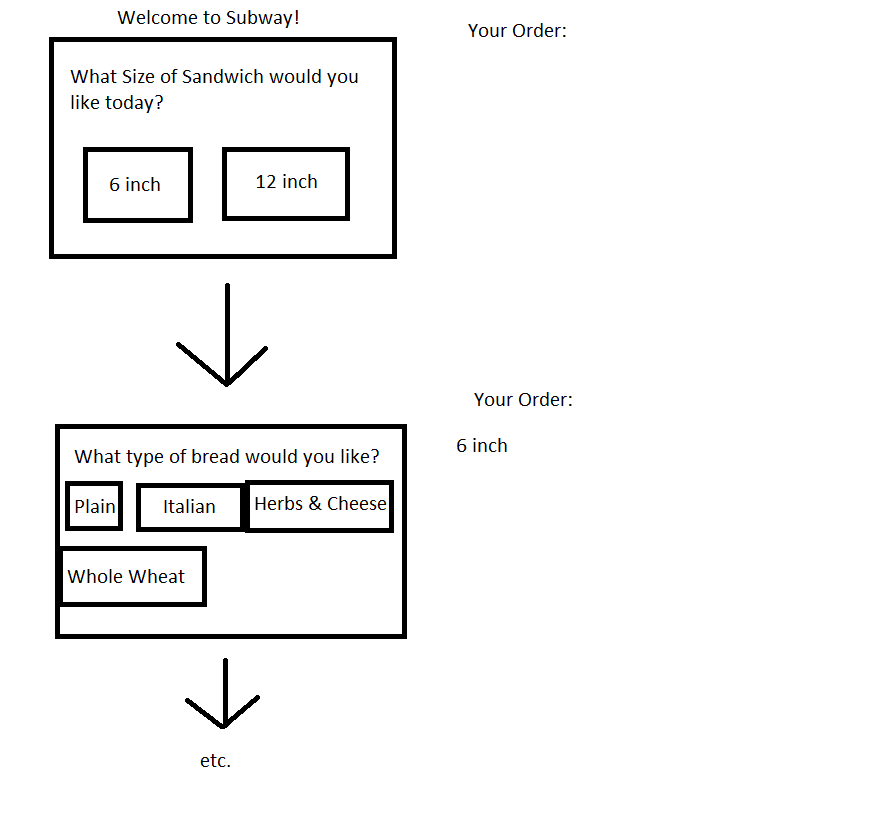

# Subway

This project will be an ordering menu for Subway. It will include an ordering menu pane and a pane to display the final order along with the price of the sandwich(if we have time for this extra feature)

## Example Output

This image will display as your example output. Name the image README.jpg in your project folder.



## Analysis Steps
I split this project into two parts, building the sandwich using method calling and some programming logic and storing the information in an array, 
and displaying that information in a javafx pane.


### Design
We were originally going to have two panes side by side, with one pane asking questions about the sandwich and the other pane updating the price of the sandwich and the ingredients.
We were unable to implement javafx so I did the best that I could in the console.


```
Give examples
```

### Testing

I ran the code a few times and selected different numbers each time.

## Notes

I did not get the team participation that I expected and the project turned out far worse than what it could have been.

## Do not change content below this line
## Adapted from a README Built With

* [Dropwizard](http://www.dropwizard.io/1.0.2/docs/) - The web framework used
* [Maven](https://maven.apache.org/) - Dependency Management
* [ROME](https://rometools.github.io/rome/) - Used to generate RSS Feeds

## Contributing

Please read [CONTRIBUTING.md](https://gist.github.com/PurpleBooth/b24679402957c63ec426) for details on our code of conduct, and the process for submitting pull requests to us.

## Versioning

We use [SemVer](http://semver.org/) for versioning. For the versions available, see the [tags on this repository](https://github.com/your/project/tags). 

## Authors

* **Billie Thompson** - *Initial work* - [PurpleBooth](https://github.com/PurpleBooth)

See also the list of [contributors](https://github.com/your/project/contributors) who participated in this project.

## License

This project is licensed under the MIT License - see the [LICENSE.md](LICENSE.md) file for details

## Acknowledgments

* Hat tip to anyone who's code was used
* Inspiration
* etc
